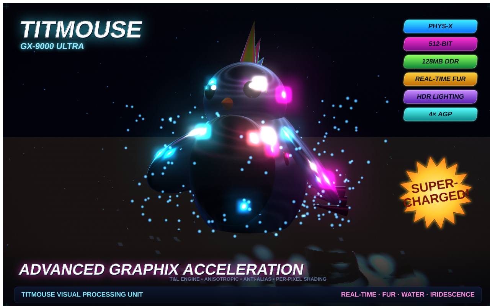

# TITMOUSE — Y2K GPU Box-Art Renderer

A self-contained WebGL/Three.js renderer that generates hoodie-ready graphics in the style of
late-'90s / early-'00s **3D graphics-card box art** (the *Overclocked* era — GeForce / 3dfx Voodoo /
Radeon retail boxes). The hero is a chrome **cyber-titmouse** bursting out of reflective water, built
to show off the same things those boxes bragged about: **reflections, fur, water, and iridescence.**

Made for **Titmouse** (the animation studio) — the mascot riffs on the tufted-titmouse bird.



## Run it

Because ES-module `importmap` needs `http://` (not `file://`), serve the folder:

```bash
cd y2k-gpu-boxart
python3 -m http.server 8000
# open http://localhost:8000
```

No internet required — Three.js and its addons are vendored in `vendor/`.

## Controls

| | |
|---|---|
| **Body finish** | Chrome · Iridescent · Holo-Energy (custom GLSL fresnel shader) |
| **Backdrop** | Void · Sunset · Cyber · Studio |
| **Sliders** | Bloom · Chroma/CRT · Auto-spin · Water level |
| **Mouse** | drag = orbit · scroll = zoom |
| **`H`** | hide/show the control panel |
| **`E`** / **EXPORT PNG (4K)** | 3840-wide composited PNG (3D art + box-art type) |
| **Clean render** | 3D only, no text overlay (add type in your design app) |

Every word on the art is editable in the **`COPY`** object at the top of `index.html`.

## What's custom in here

- **Hand-written GLSL** holographic/iridescent fresnel shader (`holoMat`)
- **Shell-based fur** via a per-shell `onBeforeCompile` material
- **Procedural studio environment** — bright softboxes drive the chrome reflections while a separate
  moody gradient sits behind the hero (the trick that makes mirror-metal read on a dark background)
- Reflective **water** (Three.js `Water`) + splash & dust particle systems
- **Post FX:** UnrealBloom + a custom chromatic-aberration / vignette / scanline / grain pass
- **2D box-art overlay** (chrome bevelled type, gel spec-badges, sunburst seal) composited into the
  PNG export at full resolution

## Files

- `index.html` — the renderer (everything's in here, heavily commented)
- `DESIGN-BRIEF.md` — copy bank, font direction, scene/creature ideas, palettes, hoodie print notes
- `samples/` — example renders
- `vendor/three/` — pinned Three.js r160 + the addons used

## Design guidance

See **[`DESIGN-BRIEF.md`](DESIGN-BRIEF.md)** for the headline/spec/model-name copy bank, font
recommendations, hero-creature ideas, color palettes, box-art layout grid, and screen-print notes for
getting the neons and chrome onto a dark hoodie.
